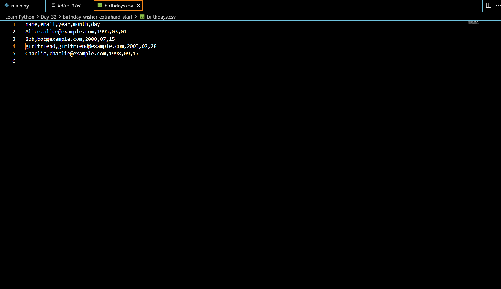
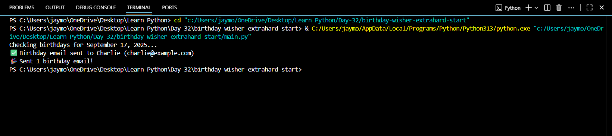
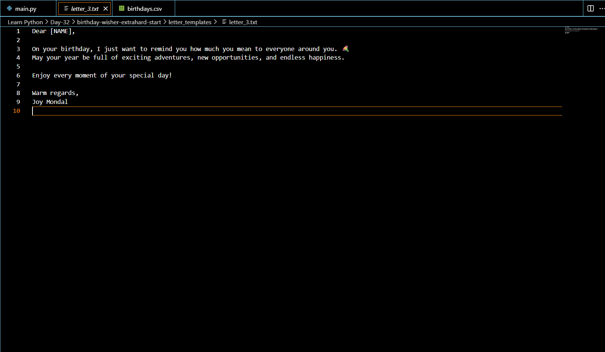

# 🎂 Birthday Mailer

[](https://www.python.org/)  
Automated **birthday email sender** built with Python.  
Reads birthdays from a CSV file, checks if today matches, and sends personalized emails via **Gmail SMTP**.  
Includes multiple templates + a special romantic letter 💌.

---

## ✨ Features
- 📅 Reads birthdays from a CSV file (`birthdays.csv`)
- 📨 Sends personalized birthday emails using Gmail SMTP
- 🎨 Randomized templates (`letter_1.txt`, `letter_2.txt`, `letter_3.txt`)
- 💖 Special romantic birthday message for your girlfriend
- ✅ Error handling for missing/invalid data
- 🔒 Gmail App Password authentication

---


## 📸 Screenshots

### 1. Birthday CSV file


### 2. Program Running


### 3. Birthday Letter Example


### 1️⃣ Clone the Repository
```bash
git clone https://github.com/your-username/birthday-mailer.git
cd birthday-mailer
